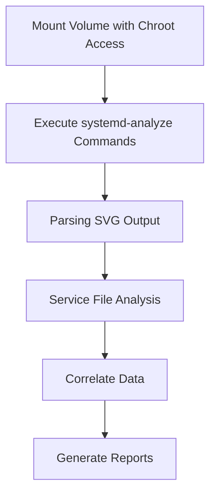
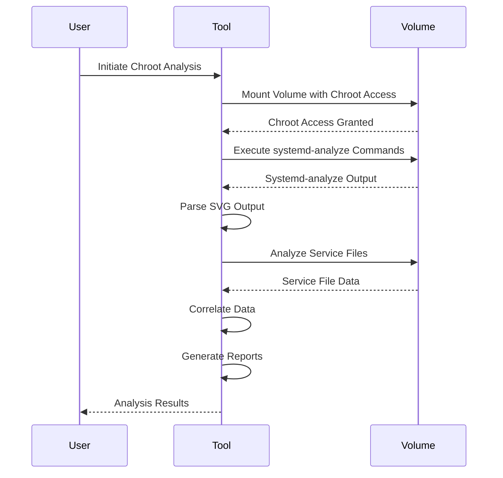

## Introduction

The Chroot analysis performed by the Startup Sbom tool utilizes Chroot access within the mounted volume to execute systemd-analyze commands. These commands generate crucial data, which is then saved into an SVG file. This SVG file serves as a cornerstone in the comprehensive analysis conducted by the tool.

This wiki aims to elucidate the intricacies of the Chroot analysis process employed by Startup Sbom. It delves into the rationale behind selecting specific commands and methods, providing insights into their significance and contribution to the analysis workflow. By detailing each step and its purpose, this documentation equips users with a deeper understanding of the tool's operation and its role in facilitating insightful system analysis.

## Table of contents
- [Methodology](#methodology)
- [Process](#process)
- [Input and Output](#input-and-output)
- [Graphical Output](#graphical-output)


## Methodology
Certainly! Based on the provided code, here's a detailed methodology explaining the Chroot analysis process:

---

## Methodology: Chroot Analysis

### Overview

The Chroot Analysis process within the Startup Sbom tool involves leveraging Chroot access within a mounted volume to perform analysis on systemd services. This analysis aims to understand service dependencies, execution times, and overall system bootup performance. This uses the `journalctl logs` and the `syslogs` for the analysis. Mainly the command:

```bash
systemd-analyze plot > bootimage.svg
```

Is used to create a copy of the boot process acurately mapped. Then we can use this information to create our own personalized mapping.

### Steps

1. **Mounting Volume with Chroot Access**: 
   - The process begins by mounting the target volume with Chroot access. This step ensures that the analysis is conducted within an isolated environment, enabling controlled examination of system configurations.

2. **Executing systemd-analyze Commands**:
   - Once the Chroot environment is set up, systemd-analyze commands are executed within this environment. These commands provide valuable insights into system bootup times, service dependencies, and execution sequences.
   - Specifically, the `systemd-analyze plot` command is utilized to generate an SVG file representing the bootup sequence. This SVG file contains essential data for further analysis.

3. **Parsing SVG Output**:
   - After executing the systemd-analyze command, the generated SVG output is parsed to extract relevant information. This includes details such as service names and their associated execution times.

4. **Service File Analysis**:
   - The Chroot Analysis process involves analyzing systemd service files located within the mounted volume. These files provide insights into service dependencies, ordering, and configurations.
   - The Chroot Analyzer tool parses these service files to extract information about service dependencies, such as services that need to start before or after a particular service.

5. **Correlating Data**:
   - The extracted data from both the systemd-analyze output and the service files are correlated to provide a comprehensive view of system bootup behavior. This correlation helps identify dependencies between services, execution times, and potential bottlenecks.

6. **Generating Reports**:
   - Finally, the Chroot Analysis process concludes by generating detailed reports based on the correlated data. These reports provide insights into system bootup performance, service dependencies, and potential optimization opportunities.
   - Optionally, graphical representations such as flowcharts or diagrams may be generated to visualize the system bootup sequence and service dependencies.

## Process

#### Flowchart:


#### Sequence Diagram:


### Explanation:

1. **Mounted Volume**: 
   - This is the directory that contains the root filesystem of the target system. It is mounted with Chroot access to create an isolated environment for analysis.
   - Example: `/mnt/chroot`

2. **Systemd Service Files**:
   - These files define the configuration and behavior of systemd services on the target system.
   - Example: `/mnt/chroot/etc/systemd/system/service_name.service`

3. **SVG Output File**:
   - This file contains the graphical representation of the bootup sequence generated by the `systemd-analyze plot` command.
   - Example: `bootup.svg`

### Commands

1. **Mounting Volume with Chroot Access**:
   - This command mounts the target volume with Chroot access to create an isolated environment for analysis:
     ```bash
     sudo mount --bind /path/to/diskimage /mnt/chroot
     sudo mount -t proc none /mnt/chroot/proc
     sudo mount --rbind /sys /mnt/chroot/sys
     sudo mount --make-rslave /mnt/chroot/sys
     sudo mount --rbind /dev /mnt/chroot/dev
     sudo mount --make-rslave /mnt/chroot/dev
     ```

2. **Executing systemd-analyze Commands**:
   - This command is used to execute systemd-analyze commands within the Chroot environment to gather bootup sequence data:
     ```bash
     sudo chroot /mnt/chroot systemd-analyze plot > bootup.svg
     ```

### Example Usage:

1. **Mounting Volume with Chroot Access**:
   - Mount the target disk image containing the root filesystem with Chroot access:
     ```bash
     sudo mount --bind /path/to/diskimage /mnt/chroot
     sudo mount -t proc none /mnt/chroot/proc
     sudo mount --rbind /sys /mnt/chroot/sys
     sudo mount --make-rslave /mnt/chroot/sys
     sudo mount --rbind /dev /mnt/chroot/dev
     sudo mount --make-rslave /mnt/chroot/dev
     ```

2. **Executing systemd-analyze Commands**:
   - Execute systemd-analyze plot command within the Chroot environment to generate bootup sequence data:
     ```bash
     sudo chroot /mnt/chroot systemd-analyze plot > bootup.svg
     ```

### Explanation:

- The mounted volume provides access to the target system's filesystem, allowing analysis within an isolated environment.
- Systemd service files located within the mounted volume define the configuration and behavior of services on the target system.
- The `systemd-analyze plot` command generates a graphical representation of the bootup sequence, which is saved as an SVG file.
- By executing these commands within the Chroot environment, the analysis remains isolated from the host system, ensuring accurate results.

## Input and Output
- Input (Mounted Volume with Chroot Access):
    - The mounted volume serves as the source of data for the analysis process. It contains the root filesystem of the target system, including configuration files, systemd service files, and other system data.
    - By mounting the volume with Chroot access, the analysis process operates within an isolated environment, ensuring that the analysis does not affect the host system and providing a controlled environment for accurate analysis.

- Output (SVG Output File):
    - The SVG output file is generated by the systemd-analyze plot command within the Chroot environment. It represents the bootup sequence of the system graphically, illustrating the dependencies between systemd services and their execution times.
    - The SVG file provides a visual representation of the system bootup process, allowing users to identify service dependencies, execution order, and potential bottlenecks.

- Analysis Reports:
    - In addition to the SVG output file, the Chroot analysis process may generate detailed analysis reports based on the extracted data from the SVG file and systemd service files.
    - These reports provide insights into various aspects of system bootup performance, including service dependencies, execution times, and optimization opportunities.
    - Analysis reports may include textual summaries, tables, or charts summarizing the analysis results, allowing users to interpret and act upon the analysis findings effectively.

## Graphical Output

The graphical output generated by the Chroot analysis process visualizes the bootup sequence of the system, illustrating systemd services, their dependencies, and execution times. Each component of the graphical output provides valuable insights into the system's behavior during bootup.

1. **Service Nodes**:
   - Each node in the graphical output represents a systemd service that is part of the system bootup process. These nodes typically include the name of the service and its execution time.
   - **Example**: `systemd-journald.service (Execution Time: 8ms)` represents the systemd-journald service with an execution time of 8 milliseconds.

2. **Dependencies**:
   - Arrows between nodes indicate dependencies between systemd services. These dependencies define the order in which services must start during system bootup.
   - **Example**: If `Service A` has an arrow pointing to `Service B`, it means that `Service A` must start before `Service B` during bootup.

3. **Execution Times**:
   - The execution time of each service is provided next to its respective node. This represents the time taken by the service to start and execute during the bootup process.
   - **Example**: An execution time of `8ms` indicates that the corresponding service took 8 milliseconds to start and execute during bootup.

4. **Before and After Relationships**:
   - Labels on arrows denote whether one service must start "Before" or "After" another service. This information helps understand the sequential order of service execution.
   - **Example**: If `Service A` has an arrow labeled "Before" pointing to `Service B`, it means that `Service A` must start before `Service B`.

### Practical Examples:

1. **Understanding Service Dependencies**:
   - By analyzing the graphical output, administrators can understand the dependencies between systemd services. For example, if `Service A` depends on `Service B`, any issues with `Service B` may impact the startup of `Service A`.

2. **Identifying Bottlenecks**:
   - The execution times provided in the graphical output help identify potential bottlenecks during system bootup. Services with longer execution times may indicate areas for optimization or troubleshooting.
   - For instance, if `Service A` has a significantly longer execution time compared to other services, administrators may investigate potential reasons for the delay and take necessary actions to optimize its performance.

3. **Optimization Opportunities**:
   - The graphical output serves as a basis for identifying optimization opportunities within the bootup process. By understanding service dependencies and execution times, administrators can streamline the bootup sequence to improve overall system performance.
   - For example, if multiple services have similar dependencies and execution times, administrators may consider parallelizing their startup to reduce bootup time.

### Example:

```mermaid
graph TD;
    Systemd_Init["Systemd Init"] -->|Before| systemd-binfmt["Systemd Binfmt (8ms)"];
    Systemd_Init -->|Before| systemd-journald["Systemd Journald (8ms)"];
    Systemd_Init -->|Before| systemd-logind["Systemd Logind (8ms)"];
    Systemd_Init -->|Before| systemd-modules-load["Systemd Modules Load (8ms)"];
    Systemd_Init -->|Before| systemd-remount-fs["Systemd Remount FS (8ms)"];
    Systemd_Init -->|Before| systemd-sysctl["Systemd Sysctl (8ms)"];
    Systemd_Init -->|Before| systemd-update-utmp["Systemd Update Utmp (8ms)"];
    Systemd_Init -->|Before| systemd-user-sessions["Systemd User Sessions (8ms)"];
    systemd-binfmt -->|After| systemd-modules-load;
    systemd-binfmt -->|After| local-fs.target;
    systemd-journald -->|After| systemd-journald.socket;
    systemd-journald -->|After| systemd-journald-dev-log.socket;
    systemd-journald -->|After| systemd-journald-audit.socket;
    systemd-journald -->|After| syslog.socket;
    systemd-logind -->|After| nss-user-lookup.target;
    systemd-logind -->|After| user.slice;
    systemd-logind -->|After| modprobe-AT-drm.service;
    systemd-logind -->|After| dbus.socket;
    systemd-remount-fs -->|After| systemd-fsck-root.service;
    systemd-sysctl -->|After| systemd-modules-load.service;
    systemd-update-utmp -->|After| systemd-remount-fs.service;
    systemd-update-utmp -->|After| systemd-tmpfiles-setup.service;
    systemd-update-utmp -->|After| auditd.service;
    systemd-user-sessions -->|After| remote-fs.target;
    systemd-user-sessions -->|After| nss-user-lookup.target;
    systemd-user-sessions -->|After| network.target;
    systemd-user-sessions -->|After| home.mount;
    systemd-udevd -->|After| systemd-sysusers.service;
    systemd-udevd -->|After| systemd-hwdb-update.service;
    NetworkManager -->|After| network-pre.target;
    NetworkManager -->|After| dbus.service;
    containerd -->|After| local-fs.target;
```


### Why Use This Method?

Utilizing this method offers a comprehensive view of the exact execution processes. Instead of speculating potential executions, it provides detailed insights into the actual executions that occurred.