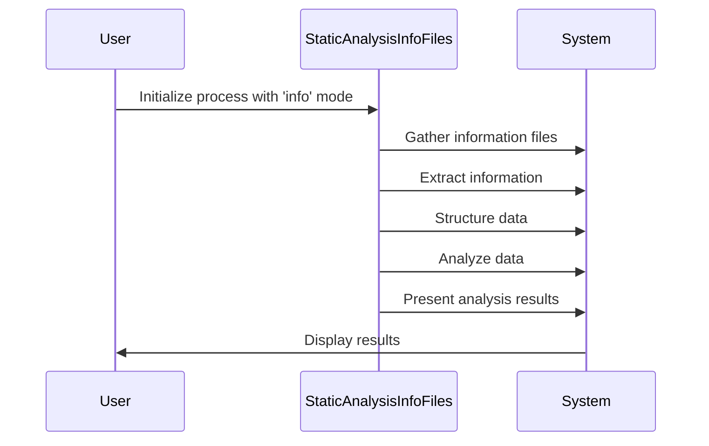
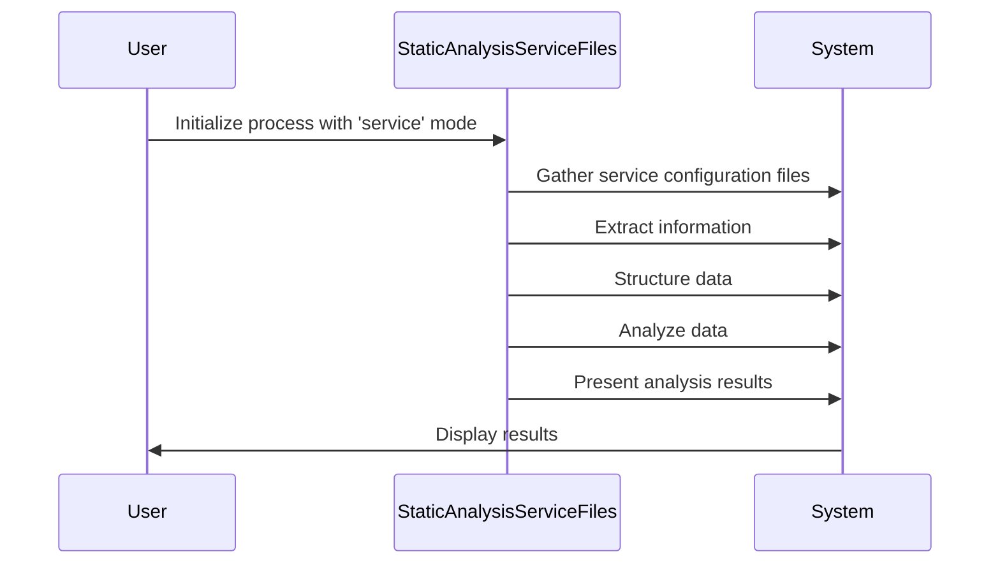

## Introduction

The static analysis process of the Startup-sbom project is a systematic endeavor aimed at reverse engineering and examining packages executed during system startup. It involves gathering relevant system files and services, extracting pertinent information, structuring the data for analysis, identifying patterns and dependencies, and presenting the insights gained in various formats. This process serves to enhance security, optimize performance, and streamline maintenance by providing stakeholders with valuable insights into the composition and behavior of startup packages.

## Table of contents
- [Methodology](#methodology)
- [Process](#process)
- [Input and Output](#input-and-output)

## Methodology

The static analysis process within the Startup-sbom project encompasses two modes of operation: `info` and `service`. Each mode employs a distinct methodology tailored to gather and analyze information from different sources within the system. Below is a detailed explanation of the methodology used in both modes:

### Mode: `info`

**Methodology:**

1. **Data Collection**: The process begins by gathering relevant information files from the system, typically located in the `/var/lib/dpkg/info` directory. These information files contain metadata about installed packages and their configurations.

2. **Information Extraction**: Each information file is parsed to extract essential details such as package names and associated service configurations.

3. **Data Structuring**: The extracted information is organized into structured data models, such as the `static_mode_entry_info` class, which encapsulates package details along with executable paths and names.

4. **Analysis and Insights**: Analyzing the gathered data reveals insights into the packages executed during system startup, including their dependencies and configurations.

5. **Presentation**: The analysis results are presented in a user-friendly format, such as tables or JSON files, providing stakeholders with a clear understanding of the startup packages and their attributes.

### Mode: `service`

**Methodology:**

1. **Data Collection**: In this mode, the focus shifts to gathering service configuration files, typically located in the `/lib/systemd/system` directory. These files define the behavior and dependencies of services that run during system startup.

2. **Information Extraction**: Each service configuration file is parsed to extract executable paths and associated package names.

3. **Data Structuring**: The extracted information is structured using the `static_mode_entry_service` class, which organizes service details along with executable paths and names, grouped by package.

4. **Analysis and Insights**: Analyzing the gathered data provides insights into the relationship between services, executable paths, and installed packages, enabling stakeholders to identify dependencies and potential issues.

5. **Presentation**: The analysis results are presented in a comprehensible format, allowing stakeholders to visualize the relationships between services, packages, and executable paths, facilitating informed decision-making.

## Process

### Mode: `info`

**Process Overview:**

1. **Data Collection**: 
   - Gather information files from the system, typically located in `/var/lib/dpkg/info`.

2. **Information Extraction**:
   - Parse each information file to extract package names and associated service configurations.

3. **Data Structuring**:
   - Organize extracted information into structured data models, encapsulating package details along with executable paths and names.

4. **Analysis and Insights**:
   - Analyze gathered data to identify patterns, dependencies, and configurations of startup packages.

5. **Presentation**:
   - Present analysis results in user-friendly formats, such as tables or JSON files, to provide stakeholders with insights into startup packages and their attributes.

### Mode: `service`

**Process Overview:**

1. **Data Collection**:
   - Gather service configuration files from the system, typically located in `/lib/systemd/system`.

2. **Information Extraction**:
   - Parse each service configuration file to extract executable paths and associated package names.

3. **Data Structuring**:
   - Structure extracted information using predefined data models, organizing service details along with executable paths and names, grouped by package.

4. **Analysis and Insights**:
   - Analyze the gathered data to understand the relationships between services, executable paths, and installed packages, identifying dependencies and potential issues.

5. **Presentation**:
   - Present the analysis results in a comprehensible format, enabling stakeholders to visualize relationships between services, packages, and executable paths, facilitating informed decision-making.

### Sequence Diagrams

#### Mode: `info`

#### Mode: `service`

### Explanation of Process

- **Data Collection**: 
   - In both modes, the process begins by collecting relevant files from the system, which contain information about packages (`info` mode) or service configurations (`service` mode).

- **Information Extraction**: 
   - Each file is then parsed to extract pertinent details, such as package names, service configurations, executable paths, etc.

- **Data Structuring**: 
   - The extracted information is structured into predefined data models, organizing it in a format suitable for analysis and presentation.

- **Analysis and Insights**: 
   - The structured data is analyzed to uncover patterns, dependencies, and other insights related to startup packages or services.

- **Presentation**: 
   - Finally, the analysis results are presented in a user-friendly format, enabling stakeholders to understand and act upon the insights gained from the analysis.

## Input and Output
### Inputs
#### Mode: `info`

1. **Information Files**:
   - Input data for the `info` mode includes information files typically located in the `/var/lib/dpkg/info` directory. These files contain metadata about installed packages, including package names, versions, and configurations.

#### Mode: `service`

1. **Service Configuration Files**:
   - The `service` mode requires service configuration files, usually found in the `/lib/systemd/system` directory. These files define the behavior, dependencies, and execution parameters of system services.

### Outputs

#### Mode: `info`

1. **Structured Data**:
   - The output of the `info` mode is structured data encapsulating information extracted from information files. This data includes package names, service configurations, executable paths, and other relevant details.

2. **Analysis Results**:
   - The analysis results provide insights into the composition, dependencies, and configurations of startup packages. These insights are presented in user-friendly formats, such as tables or JSON files, for stakeholders to review and act upon.

#### Mode: `service`

1. **Structured Data**:
   - Similar to the `info` mode, the output of the `service` mode is structured data representing information extracted from service configuration files. This data includes service names, executable paths, associated package names, and other relevant details.

2. **Analysis Results**:
   - The analysis results offer insights into the relationships between services, executable paths, and installed packages. These insights are presented in formats conducive to visualization, enabling stakeholders to understand the dependencies and potential issues related to system services.