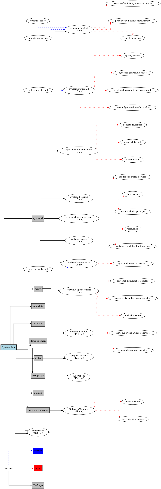

# Startup-SBOM

This is a simple SBOM utility which aims to provide an insider view on which packages are getting executed.

The process and objective is simple we can get a clear perspective view on the packages installed by APT (*currently working on implementing this for RPM and other package managers*). This is mainly needed to check which all packages are actually being executed.

## Installation
The packages needed are mentioned in the  `requirements.txt` file and can be installed using pip:
```bash
pip3 install -r requirements.txt
```

## Usage
- First of all install the packages.
- Secondly , you need to set up environment variables such as:
    - `Mount the image:` Currently I am still working on a mechanism to automatically define a mount point and mount different types of images and volumes but its still quite a task for me.
- Finally run the tool to list all the packages.


| Argument          | Description                                                                                                      |
|-------------------|------------------------------------------------------------------------------------------------------------------|
| `--analysis-mode` | Specifies the mode of operation. Default is `static`. Choices are `static` and `chroot`.                         |
| `--static-type`   | Specifies the type of analysis for static mode. Required for static mode only. Choices are `info` and `service`. |
| `--volume-path`   | Specifies the path to the mounted volume. Default is `/mnt`.                                                     |
| `--save-file`     | Specifies the output file for JSON output.                                                                       |
| `--info-graphic`  | Specifies whether to generate visual plots for CHROOT analysis. Default is `True`.                               |
| `--pkg-mgr`     |  Manually specify the package manager or dont add this option for automatic check.                                                          |
**APT:**
- *Static Info Analysis:*
    - This command runs the program in static analysis mode, specifically using the Info Directory analysis method.
    - It analyzes the packages installed on the mounted volume located at `/mnt`.
    - It saves the output in a JSON file named `output.json`.
    - It generates visual plots for CHROOT analysis.

    ```bash
    python3 main.py --pkg-mgr apt --analysis-mode static --static-type info --volume-path /mnt --save-file output.json
    ```
- *Static Service Analysis:*

   - This command runs the program in static analysis mode, specifically using the Service file analysis method.
   - It analyzes the packages installed on the mounted volume located at `/custom_mount`.
   - It saves the output in a JSON file named `output.json`.
   - It does not generate visual plots for CHROOT analysis.
    ```bash
    python3 main.py --pkg-mgr apt --analysis-mode static --static-type service --volume-path /custom_mount --save-file output.json --info-graphic False
    ```

- *Chroot analysis with or without Graphic output:*
   - This command runs the program in chroot analysis mode.
   - It analyzes the packages installed on the mounted volume located at `/mnt`.
   - It saves the output in a JSON file named `output.json`.
   - It generates visual plots for CHROOT analysis.
   - For graphical output keep `--info-graphic` as `True` else `False`
    ```bash
    python3 main.py --pkg-mgr apt --analysis-mode chroot --volume-path /mnt --save-file output.json --info-graphic True/False
    ```

**RPM**
- *Static Analysis:*
    - Similar to how its done on apt but there is only one type of static scan avaialable for now.
    ```bash
    python3 main.py --pkg-mgr rpm --analysis-mode static --volume-path /mnt --save-file output.json
    ```

- *Chroot analysis with or without Graphic output:*
   - Exactly how its done on apt.
    ```bash
    python3 main.py --pkg-mgr rpm --analysis-mode chroot --volume-path /mnt --save-file output.json --info-graphic True/False
    ```

## Supporting Images
Currently the tool works on Debian and Red Hat based images I can guarentee the debian outputs but the Red-Hat onces still needs work to be done its not perfect.

I am working on the pacman side of things I am trying to find a relaiable way of accessing the pacman db for static analysis.

## Graphical Output Images (Chroot)
### APT Chroot


### RPM Chroot


## Inner Workings
For the workings and process related documentation please read the wiki page: [Link](https://github.com/morpheuslord/Startup-SBOM/wiki)


## TODO
- [x] Support for RPM
- [x] Support for APT
- [x] Support for Chroot Analysis
- [x] Support for Versions
- [x] Support for Chroot Graphical output
- [ ] Support for Pacman
- [ ] Support for organized graphical output

Ideas regarding these are welcome in the discussions page.